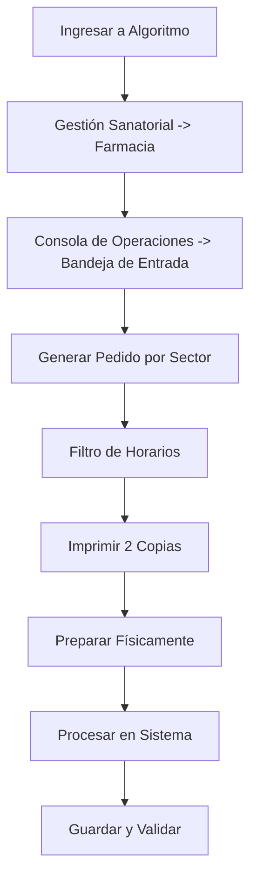

# GUÍA DE INDUCCIÓN Y CAPACITACIÓN: JEFATURA DE FARMACIA Y DIRECCIÓN TÉCNICA

Esta guía ha sido diseñada para capacitar desde cero a la nueva Jefa de Farmacia / Directora Técnica (DT). Consolida y organiza la documentación dejada por la gestión anterior, estructurándola de forma lógica y secuencial.

---

## ÍNDICE DE MÓDULOS
* [MÓDULO 1: Estructura Organizativa, Responsabilidades de la DT y Horarios](#módulo-1-estructura-organizativa-responsabilidades-de-la-dt-y-horarios)
* [MÓDULO 2: Operaciones Clínicas Diarias y Gestión de Pedidos](#módulo-2-operaciones-clínicas-diarias-y-gestión-de-pedidos)
* [MÓDULO 3: Gestión de Stock, Compras y Facturación](#módulo-3-gestión-de-stock-compras-y-facturación)
* [MÓDULO 4: Controles Regulatorios, Auditoría y Reportes Administrativos](#módulo-4-controles-regulatorios-auditoría-y-reportes-administrativos)

---

## MÓDULO 1: Estructura Organizativa, Responsabilidades de la DT y Horarios

### 1.1. Organigrama de Relaciones en el Sanatorio

Para un correcto funcionamiento, es fundamental identificar a las personas clave en cada sector de la institución:

| Sector / Rol | Nombre / Contacto |
| :--- | :--- |
| **Jefatura de Farmacia (DT)** | Gabriela Montenegro |
| **Jefatura de Laboratorio** | Virginia Papa |
| **Jefatura de Depósito / Suministros** | Marcelo Rojas |
| **Representante de Administración y Guardia** | Jesica Molina |
| **Facturación de Obras Sociales (O.S.)** | Alicia Delpopolo |
| **Enfermería - Internación** | Paula Micuchi |
| **Consultorios Ext., Diag. por Imagen y Central de Turnos** | Germán Herrera |
| **Dirección Médica** | Gastón Caporella / Jorge Khoan |
| **Gerente Financiero & General** | Germán Monti |
| **Presidencia** | Pablo Jukic |
| **Representante de Compras** | Daiana Iantosca |

**Equipo de Farmacia (Personal a cargo):**
* Gabriela (DT)
* Marianela, Mariza, Karina, Patricia, Soledad, Antonela, Aníbal.

---

### 1.2. Listado de Tareas de la Directora Técnica (DT)

El rol de la DT abarca responsabilidades legales, técnicas y administrativas que deben ejecutarse con rigor:

#### Tareas Diarias
1. **Control y pasado de compras diarias**: Debe ser **la primera tarea del día**.
2. **Revisión de sueros diarios** e indicaciones médicas.
3. **Solicitud de autorizaciones a obras sociales**: Vía email, plataforma *MICAM* o trámite por *Acto Médico*.
4. **Control de indicaciones y recetas**.

#### Tareas Periódicas y de Control
* **Libros Oficiales**: Llevar al día el *Libro de Recetarios* y el *Libro Contralor de Psicotrópicos y Estupefacientes*.
* **Trazabilidad**: Gestión y control de transacciones a través de la plataforma de la **ANMAT (SNT)**.
* **Control de Temperatura**: Registro diario de las planillas de control de heladeras de medicamentos.
* **Vencimientos de Medicamentos**: Control y rotación de stock por fecha de vencimiento.
* **Gestión de Precios**:
  * Actualización de precios de la obra social **IAPOS** (en conjunto con Nicolás de Sistemas).
  * Actualización de precios de **Global** (frecuencia trimestral, previo aviso de Pablo).
  * Actualización de precios según las compras realizadas de insumos descartables.
* **Licitaciones y Compras**: Gestión de licitaciones de medicamentos (ampollas, comprimidos), descartables y coordinación del pool de compras.
* **Personal**: Armado y control de los horarios del equipo de farmacia ("los chicos").
* **Mantenimiento**: Control mensual de bombas de infusión en los distintos sectores.
* **Vademécum**: Mantener actualizados los vademécum de la institución y definir nuevos códigos en el sistema.
* **Residuos Peligrosos**: Gestión y control de la disposición final de los mismos.

---

### 1.3. Horarios del Sector y Barridos

La farmacia opera bajo distintos esquemas horarios según el día:

* **Lunes a Viernes**: 07:00 a 22:00 hs.
* **Sábados**: 07:00 a 19:00 hs.
* **Domingos**: 10:00 a 18:00 hs.
* **Feriados**: 07:00 a 16:00 hs.

---

## MÓDULO 2: Operaciones Clínicas Diarias y Gestión de Pedidos

### 2.1. Procesamiento de Pedidos de Internación (P.O.E.)

Este procedimiento garantiza que los pacientes internados en los pisos (1ro al 5to) reciban su medicación de manera oportuna y correcta.



#### Paso a Paso del Procedimiento:
1. **Acceso**: Ingrese al sistema **Algoritmo** con sus credenciales personales.
2. **Navegación**: Diríjase a **Gestión Sanatorial** -> **Farmacia** -> **Consola de Operaciones** -> **Bandeja de Entrada**.
3. **Generación**:
   * Seleccione la pestaña **Generar Pedido**.
   * Elija el **Sector** (por ejemplo, *Internación 1er Piso*, *2do Piso*, etc.).
   * Ingrese el rango horario: **Desde las 12:00 hs del día actual** hasta las **11:00 hs del día siguiente**.
   * Presione el botón **Generar**.
4. **Obtención de Indicaciones**:
   * Regrese a **Bandeja de Entrada**.
   * En el campo **Destino**, elija el sector correspondiente y haga clic en **Obtener**.
   * Aparecerá la lista con las indicaciones de todos los pacientes del sector.
5. **Impresión**:
   * Haga clic derecho sobre cada paciente y seleccione **Imprimir**.
   * Imprima **dos (2) copias**: una para control de la farmacia y otra que se envía físicamente junto con la medicación.
6. **Preparación y Procesamiento**:
   * Una vez armado físicamente el pedido, haga clic derecho sobre el paciente y seleccione **Procesar**.
   * **Modificar cantidades**: Si entrega menos de lo pedido, reste la cantidad (el sistema lo registrará como deuda).
   * **Cancelar un producto**: Coloque la cantidad en `0` y tilde la casilla de verificación *Cancela*.
   * **Agregar un producto (+)**: Presione el botón `+`, escriba la letra `V` y presione `F3` para buscar el código del producto a añadir.
7. **Cierre**: Finalizada la revisión del pedido, presione **Guardar**.

---

### 2.2. Cronograma de Barridos Horarios (Consola de Operaciones)

El "barrido" es la acción en sistema que consolida las planificaciones de enfermería y genera el comprobante **PMP (Pedido de Medicamentos por Paciente)** para su posterior preparación.

> [!NOTE]
> Los barridos marcados como **"SUPERVISIÓN"** implican revisar las indicaciones del período para detectar inconsistencias antes de procesar el pedido masivo.

| Día | Hora del Barrido | Rango de Cobertura del Barrido | Observaciones |
| :--- | :--- | :--- | :--- |
| **Martes a Viernes** | **07:00 hs** | 22:00 hs (día anterior) a 06:00 hs (día actual) | **SUPERVISIÓN** |
| | *07:00 hs* | 16:00 hs (día anterior) a 06:00 hs (día actual) | **SUPERVISIÓN** *(solo si el día anterior fue feriado)* |
| | **08:00 hs** | 06:00 hs a 11:00 hs | |
| | **11:00 hs** | 06:00 hs a 17:00 hs | |
| | **14:00 hs** | 14:00 hs a 13:00 hs (del día posterior) | |
| | **19:00 hs** | 14:00 hs a 13:00 hs (del día posterior) | |
| **Sábados** | **07:00 hs** | 22:00 hs (día anterior) a 06:00 hs (día actual) | **SUPERVISIÓN** |
| | *07:00 hs* | 16:00 hs (día anterior) a 06:00 hs (día actual) | **SUPERVISIÓN** *(solo si el día anterior fue feriado)* |
| | **08:00 hs** | 06:00 hs a 13:00 hs | |
| | **10:00 hs** | 09:00 hs a 09:00 hs (del día posterior) | |
| | **13:00 hs** | 13:00 hs a 13:00 hs (del día posterior) | Se realizan barridos cortos adicionales antes de las 19:00 hs |
| **Domingos** | **10:00 hs** | 19:00 hs (día anterior) a 10:00 hs (día actual) | **SUPERVISIÓN** |
| | **11:00 hs** | 11:00 hs a 11:00 hs (del día posterior) | Se realizan barridos cortos adicionales antes de las 18:00 hs |
| **Lunes** | **07:00 hs** | 18:00 hs (día anterior) a 06:00 hs (día actual) | **SUPERVISIÓN** |
| | **08:00 hs** | 06:00 hs a 11:00 hs | |
| | **11:00 hs** | 07:00 hs a 17:00 hs | |
| | **14:00 hs** | 14:00 hs a 13:00 hs (del día posterior) | |
| | **19:00 hs** | 14:00 hs a 13:00 hs (del día posterior) | |

#### Esquema de Barridos para Feriados:
* **Feriados de Martes a Viernes**:
  * **07:00 hs**: Barrido de 22:00 hs (día anterior) a 06:00 hs (día actual) - **SUPERVISIÓN** *(siempre que el día anterior la farmacia haya cerrado a las 22:00 hs)*.
* **Lunes Feriado**:
  * **07:00 hs**: Barrido de 18:00 hs (día anterior) a 06:00 hs (día actual) - **SUPERVISIÓN** *(siempre que el día anterior haya sido domingo)*.
* **Feriado Continuo (Feriado post Feriado)**:
  * **07:00 hs**: Barrido de 16:00 hs (día anterior) a 06:00 hs (día actual) - **SUPERVISIÓN** *(siempre que el día anterior haya sido feriado)*.
  * **10:00 hs**: Barrido de 09:00 hs a 09:00 hs.
  * *Barridos cortos*: Se realizan barridos cortos antes de las 16:00 hs.

---

### 2.3. Gestión de Medias Dosis en Ampollas

Cuando un médico prescribe una "media dosis" de un inyectable, la farmacia debe entregar la ampolla completa por razones prácticas de dispensación. Sin embargo, para evitar pérdidas de facturación y stock, el registro debe ser preciso.

#### Regla General
Ajustar la cantidad a **una (1) ampolla completa** en el sistema para que se descuente del inventario y se facture correctamente, **excepto** en aquellos fármacos reconstituidos que poseen estabilidad comprobada para ser conservados y reutilizados.

#### Excepciones: Ampollas que SÍ se pueden conservar (No requieren ajuste en sistema)

| Medicamento | Estabilidad Reconstituida |
| :--- | :--- |
| **Aciclovir** (Frasco Ampolla) | 12 hs a Temperatura Ambiente (T.A.) |
| **Anfotericina B** (Común y Liposomal) | 24 hs en Heladera |
| **Aztreonam** | 48 hs a T.A. / 7 días en Heladera |
| **Cefalotina** | 12 hs a T.A. / 96 hs en Heladera |
| **Cefazolina** | 24 hs a T.A. / 7 días en Heladera |
| **Cefepime** | 24 hs a T.A. / 7 días en Heladera |
| **Cefotaxima** | 12 hs a T.A. / 7 días en Heladera |
| **Ceftazidima** | 24 hs a T.A. / 7 días en Heladera |
| **Ceftriaxona** | 24 hs a T.A. / 10 días en Heladera |
| **Claritromicina** | 24 hs a T.A. / 48 hs en Heladera |
| **Colistina** | 24 hs en Heladera |
| **Fosfomicina** | 24 hs en Heladera |
| **Hidrocortisona** | 24 hs a T.A. |
| **Imipenem - Cilastatina** | 24 hs en Heladera |
| **Nitroprusiato** | 24 hs a T.A. |
| **Piperacilina + Tazobactam** | 24 hs a T.A. / 48 hs en Heladera |
| **Remifentanilo** | 24 hs a T.A. / 24 hs en Heladera |
| **Vancomicina** | 24 hs a T.A. / 96 hs en Heladera |

> [!WARNING]
> Para cualquier medicamento no listado en la tabla anterior, la estabilidad restante es nula o no segura. Debe modificarse la cantidad del vale en el sistema a **1 unidad entera**.

---

### 2.4. Circuito de Devoluciones y Conciliación de Consumo

Al egreso de un paciente o cambio de tratamiento, enfermería devuelve la medicación no utilizada en una bolsa cerrada que contiene el **PMP** impreso en el exterior.

#### Fase 1: Recolección y Análisis de Datos
1. Tome la bolsa de devolución y localice el **número de paciente** y **número de internación** en el comprobante PMP.
2. Ingrese en el sistema al reporte **"Movimiento Ocupacional por Paciente"** para conocer la fecha exacta de ingreso y egreso del paciente.
3. Ingrese al **"Reporte de Stock por Paciente"** para cruzar la información:
   * **Filtro de fechas**: Complete con el rango desde **un día antes del ingreso** hasta **un día después del egreso**.
   * Compare: *Entregado por Farmacia* vs. *Registrado como Consumido por Enfermería*.

#### Fase 2: Criterios de Evaluación Física vs. Sistema

| Escenario | Análisis del Reporte | Acción Correcta |
| :--- | :--- | :--- |
| **Caso A: Conciliación Exacta** | Entregado = Consumido (ej. 1 Abbocath entregado, 1 consumido). | No debería haber insumos en la bolsa. Si los hay, se registran como devolución al paciente genérico **"DEVOLUCIONES"** para no alterar la facturación del paciente de origen. |
| **Caso B: Consumo sin Entrega** | Entregado < Consumido (ej. 0 Aguas bidestiladas entregadas, 1 consumida). | Es un error de registro de farmacia. No debería haber insumos en la bolsa. Si los hay, regístrelos como devolución al paciente genérico **"DEVOLUCIONES"**. |
| **Caso C: Diferencia a Devolver** | Entregado > Consumido (ej. 39 Agujas entregadas, 30 consumidas. Diferencia: 9). | *Si en la bolsa hay 9 o menos*: Registre la cantidad real recibida como devolución a este paciente. <br> *Si en la bolsa hay más de 9 (ej. 12)*: Registre 9 como devolución al paciente de origen (el máximo facturable) y las 3 restantes al paciente genérico **"DEVOLUCIONES"**. |

#### Fase 3: Registro en Sistema
* Diríjase a la pantalla de devoluciones en el sistema.
* Cargue los medicamentos o descartables aprobados con sus respectivas cantidades.
* Presione **Guardar** para reintegrar el stock físico y corregir la facturación del paciente.

---

## MÓDULO 3: Gestión de Stock, Compras y Facturación

### 3.1. Revisión de Faltas y Criterios de Reposición

La revisión de stock previo al fin de semana se realiza los **días miércoles** por dos responsables designados semanalmente. El objetivo es asegurar la disponibilidad de insumos cuando no hay compras directas.

> [!IMPORTANT]
> **Criterio de Volumen**: No anote un medicamento solo porque hay pocas unidades; analice su rotación. Por ejemplo, 10 ampollas de *Adenosina* son suficientes si no hay pacientes activos; pero 10 ampollas de *Ranitidina* constituyen una falta crítica debido a su alto consumo.

#### Plazos y Criterios Generales de Pedido:
* **Medicamentos de Alta Rotación**: Solicitar reposición cuando el stock en estantería equivalga a **dos (2) días de tratamiento**.
* **Descartables generales**: Requieren una anticipación mayor debido a que los proveedores provienen de Buenos Aires. Solicitar reposición con **siete (7) días de anticipación** o al abrir la última caja de stock.
* **Sueros (Soluciones Parenterales)**: Mantener un margen de **3 a 4 días** de anticipación para coordinar la logística de entrega pesada.

#### Excepciones Específicas de Reposición:
* **Leche para Prematuros**: Posee una demora de entrega de **24 horas** (no se entrega en el mismo día).
* **Ensure**: Mantener un stock fijo de **2 unidades**. Si se utiliza una, se anota inmediatamente para reponer.
* **Insumos de Quirófano / Procedimientos** (*Peel Away, catéter Doble J, catéter de Diálisis*): Se anotan y reponen de manera unitaria a medida que se consumen.
* **Rhophylac P**: Mantener stock fijo de **1 unidad**. Si se utiliza, se repone inmediatamente.

---

### 3.2. Protocolo de Medicamentos de Alto Costo

Los medicamentos de alto costo requieren autorización previa de la Obra Social o de la Dirección Médica/Gerencia del Sanatorio.

* **Identificación Visual**: Estos productos tienen **carteles rojos** en las estanterías de la farmacia para advertir al personal que no deben entregarse sin autorización expresa de la DT.
* **Listado de Alerta (No entregar sin autorización)**:
  * Anfotericina B común / Anfotericina liposomal
  * Aztreonam (ampollas) / Fosfomicina (ampollas)
  * Alprostadil
  * Inmunoglobulina
  * Zavicefta
  * Aciclovir (Frasco ampolla)
  * Smofkaviben
  * Nutrición Lativ
  * Leucovorina
* **PAMI**:
  * Los medicamentos incluidos en el **"Listado PAMI"** pueden entregarse si la indicación médica cumple los criterios. En caso de dudas, consulte a Dirección Médica.
  * Rellene la solicitud de alto costo y llévela a Roxana en el sector de Admisión.
  * Para cualquier medicamento de alto costo de PAMI fuera de ese listado, se debe gestionar autorización previa de forma mandatoria.
* **Consumos Acumulados**: Si un fármaco no es excesivamente costoso por unidad, pero el paciente acumula un volumen de uso que representa un costo total elevado, la DT debe elevar el caso a Gerencia o Dirección Médica.
* **Catéteres**: Los catéteres venosos centrales de 1 y 2 lúmenes se consideran bajo este mismo protocolo de control de autorizaciones.

---

### 3.3. Configuración de Facturación en Gestión Sanatorial

El sanatorio opera con dos tipos de códigos en su base de datos:
1. **Código Genérico**: Utilizado para la compra y el almacenamiento en el inventario.
2. **Código de Facturación**: Utilizado para la facturación final a las obras sociales (generalmente asociado a una marca comercial).

#### Consulta de Relación de Códigos:
* Ruta: **Gestión Sanatorial** -> **Maestros Generales** -> **Medicamentos y Descartables**.
* En los campos *Tipo* y *Código*, complete con la letra **V** y el código genérico.
* Haga clic en la pestaña **Facturación** para ver el código comercial con el que se factura.

#### Excepciones por Obra Social (Institución):
* Algunas obras sociales requieren facturar con marcas comerciales específicas distintas a la general.
* Para verificarlo o configurarlo, ingrese a **Relación Medicamento/Descartable por Institución** con el código genérico y asocie la excepción correspondiente.

#### Configuración de Excepciones por Valorización:
Se utiliza cuando una obra social que no posee una lista de precios asignada solicita facturar a un valor específico diferente.
* Ruta: **Gestión Sanatorial** -> **Parámetros de Valorización y Cobertura** -> **Valorización** -> **Excepción de Valorización**.
* Complete con el código de la Obra Social.
* En los campos *Cuenta* y *Profesional*, seleccione **Todos**.
* Ingrese la fecha de vigencia (se recomienda establecerla **un mes antes** de la fecha actual).
* En *Tipo de Código*, seleccione **Medicamentos y Descartables**.
* Coloque el código de facturación y cargue el valor monetario acordado.

---

### 3.4. Modificación de Vales en Consola

Si se detectan errores en las cantidades o insumos procesados, los vales pueden modificarse mediante el número de vale obtenido previamente en la **Ficha de Movimiento**.

* **Modificar Vale a Pacientes (VMP)**:
  * Ingrese a la consola de modificación de vales.
  * Complete el número de vale y el tipo como **VMP** (Vale de Medicación por Paciente).
  * Presione aceptar, edite las líneas necesarias y guarde los cambios.
* **Modificar Vale por Sector (VMS)**:
  * Ingrese a la consola de modificación de vales.
  * Complete el número de vale y el tipo como **VMS** (Vale de Medicación por Sector).
  * Realice las modificaciones y guarde los cambios.

---

## MÓDULO 4: Controles Regulatorios, Auditoría y Reportes Administrativos

### 4.1. Cierre de Estupefacientes y Psicotrópicos (P.O.E.)

Este control legal y obligatorio se realiza de manera semanal y mensual.

```
[Planillas Diarias Firmadas] ---> [Conteo Semanal] ---> [Restar del Libro Oficial]
                                                             |
[Presentación en Inspección] <--- [Receta Oficial Co.M.I.] <--+
```

#### Control Semanal
1. Reúna las planillas diarias de entrega y realice el conteo de cada estupefaciente y psicotrópico entregado en el período de 7 días.
2. **Auditoría de firmas**: Verifique obligatoriamente que todas las planillas diarias estén firmadas y selladas por el médico responsable.
3. **Libro Oficial**: Reste la cantidad total calculada en el paso 1 al saldo del stock que figura en el libro oficial.
4. **Verificación**: Cruce el stock físico (estantería) con el stock real (libro). Si hay diferencias, investigue inmediatamente la causa (vales omitidos, ampollas rotas sin registrar, etc.).
5. **Receta Oficial**: Confeccione la receta oficial escribiendo las cantidades en número y letra. Solicite la firma del Director Médico e ingrese la transacción en los libros de control.

#### Cierre Mensual
1. Abra el archivo de Word denominado **"Cierre Estupefacientes"** para completar la planilla oficial.
2. Rellene las columnas: **Saldo Anterior**, **Entrada**, **Salida** y **Saldo a la Fecha**.
3. Imprima **dos (2) copias** de la planilla de cierre.
4. Firme y coloque el sello profesional de la DT en ambas copias.
5. Introduzca en un sobre: las planillas de pedidos diarios, las recetas oficiales correspondientes y la planilla de cierre mensual.
6. Presente el sobre en la **Inspección de Farmacias**. Una de las copias impresas de la planilla de cierre será devuelta sellada por la inspección; archívela en la carpeta física de control.

---

### 4.2. Sistema Nacional de Trazabilidad (SNT - ANMAT)

El SNT permite el seguimiento de especialidades medicinales a lo largo de la cadena de distribución. Toda transacción exitosa genera un número ID único que valida la operación.

* **GLN**: Número mundial de localización física.
* **GTIN**: Número de artículo comercial (14 caracteres numéricos).

#### Recepción (Ingreso al Sanatorio)
* Ruta: **Movimientos** -> **Transacciones pendientes de confirmación**.
* Filtre la búsqueda utilizando la fecha, el GLN de origen, el número de remito o factura, o el GTIN/Serie.
* Seleccione los productos que se han recibido físicamente y haga clic en **Confirmar Operación**.

#### Dispensa (Egreso al Paciente)
* Ruta: **Movimientos** -> **Informar**.
* Complete los siguientes campos:
  * **Fecha y hora del evento**: Debe informarse en tiempo real.
  * **Evento**: Seleccione *"Dispensación de producto al paciente"*.
  * **Tipo de Informe**: Único o Masivo. *(Solo use masivo si se entrega más de una unidad del mismo medicamento al mismo paciente, con idéntico GTIN y series numéricas consecutivas)*.
  * **GTIN**: Ingrese los 14 caracteres del código de barras (después del prefijo 01) o busque por el nombre del medicamento.
  * **Cantidad**: Deje este campo **vacío**.
  * **Serie**: Ingrese el número de serie respetando mayúsculas, minúsculas y caracteres especiales. Lote y Vencimiento se autocompletarán.
  * **Documentación**: Ingrese el número de remito o factura que acompaña la entrega del producto.
  * **Paciente**: Si posee el nombre y apellido del paciente, regístrelo en la pestaña inferior.
* Haga clic en **Aceptar**. El sistema enviará una respuesta con el **ID de transacción**. **Anote este ID de forma obligatoria**.

---

### 4.3. Gestión del Censo Sanatorial y Auditoría de Movimientos

El censo permite auditar la ocupación de camas de internación y analizar movimientos internos de los pacientes.

#### Acceso al Censo
* Ingrese a **Algoritmo** -> **Censo (Reporte)**.
* Aplique los filtros de búsqueda y seleccione *Vista Previa* para visualizar el total de camas ocupadas al final del reporte.

#### Movimiento Ocupacional por Paciente
* Muestra la trazabilidad interna del paciente (ej. pase de Guardia a Terapia, o de Terapia a Piso) con sus respectivos horarios.
* Ejemplo de lectura: Paciente ingresó el 11/07 a las 21:29 hs a Guardia y pasó a la Habitación 506 (Cama 1) del 5to piso, posee obra social PAMI e ingresó por diagnóstico de insuficiencia respiratoria.

#### Reporte de Ingresos / Egresos
* Permite ordenar los movimientos cronológicamente o por paciente.
* Muestra la fecha de ingreso, número de internación, obra social, días de internación totales y el motivo del egreso.
* **Códigos de Motivo de Egreso**:
  * **A**: Alta
  * **D**: Defunción
  * **TE**: Traslado a otro efector

---

### 4.4. Reporte de Comprobantes Emitidos y Ficha de Movimiento

Estos reportes sirven como herramientas de auditoría para verificar la correspondencia entre lo solicitado y lo efectivamente entregado.

* **PMP vs VMP**:
  * El **PMP (Pedido de Medicamentos por Paciente)** es generado por indicación médica y enfermería.
  * Al procesarlo en farmacia, se emite el **VMP (Vale de Medicamento por Paciente)**.
  * De igual manera, un **PMS (Pedido por Sector)** genera al procesarse un **VMS (Vale por Sector)**.
* **Auditoría de Comprobantes**:
  * Utilice el reporte de comprobantes emitidos para comparar el PMP con el VMP. 
  * Permite auditar discrepancias (por ejemplo, si en el PMP se solicitaron 4 jeringas y en el VMP final se entregaron 2, evaluando si queda saldo pendiente o deuda).
* **Ficha de Movimiento de un Producto**:
  * Ruta para visualizar el historial de transacciones de un artículo específico.
  * Permite extraer el número de vale para modificarlo en caso de discrepancias.
  * Muestra en la columna *Concepto* el nombre del paciente y la internación, y en la columna *Salidas* la cantidad procesada. Si la celda está vacía, indica que se procesó con cantidad cero (0).
